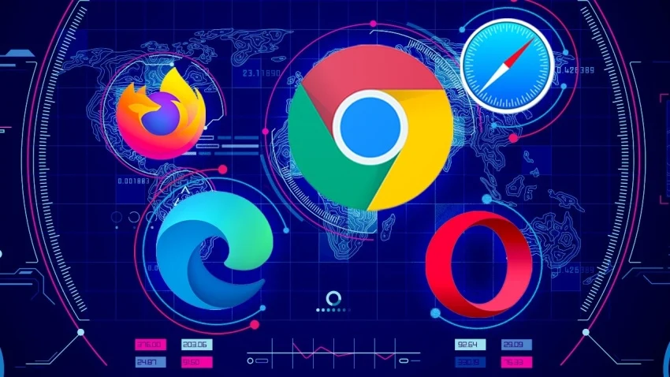

<!-- 

Criterios evaluados

    1a) Se han caracterizado y diferenciado los modelos de ejecución de código en el servidor y en el cliente web.
    1b) Se han identificado las capacidades y mecanismos de ejecución de código de los navegadores web.
    1c) Se han identificado y caracterizado los principales lenguajes relacionados con la programación de clientes web.
    1d) Se han reconocido las particularidades de la programación de guiones y sus ventajas y desventajas sobre la programación tradicional.
    1e) Se han verificado los mecanismos de integración de los lenguajes de marcas con los lenguajes de programación de clientes web.
    1f) Se han reconocido y evaluado las herramientas de programación sobre clientes web.

Actividades

    Idea de la aplicación: Describir de manera clara y concisa la idea de la aplicación web y su propósito.

    Audiencia objetivo: Definir el público para el que está destinada la aplicación, explicando su relevancia y cómo se beneficiarán de la aplicación.

    Análisis de mercado: Investigar y analizar aplicaciones similares en el mercado. Identificar características comunes y oportunidades de diferenciación para la nueva aplicación, destacando qué valor añadido ofrecerá.

    Funcionalidades clave: Identificar y listar las funcionalidades principales que ofrecerá la aplicación (ej: sistema de autenticación, gestión de usuarios, etc.).

    Modelos de ejecución (c.e. 1a): Investigar y comparar los modelos de ejecución en cliente y servidor, explicando sus diferencias y ejemplos de uso.

    Lenguajes de programación web (c.e. 1c, 1d): Analizar los lenguajes de programación más utilizados para el desarrollo web en cliente, como JavaScript y TypeScript, explicando sus ventajas y desventajas.

    Tecnologías a utilizar: Seleccionar las tecnologías (lenguajes de programación, frameworks, herramientas de desarrollo) que se utilizarán para el desarrollo de la aplicación. Justificar la elección en base a la investigación realizada. Asegurarse de incluir:

        Evaluación de los mecanismos de integración de lenguajes de marcas con lenguajes de programación de clientes web (c.e. 1e): Describir cómo los lenguajes de marcas (como HTML) se integran con los lenguajes de programación (como JavaScript) en la aplicación.

        Evaluación de herramientas de programación para clientes web (c.e. 1f): Seleccionar herramientas de desarrollo (editores de código, frameworks, bibliotecas) y justificar su elección. Explicar las funciones y ventajas de cada herramienta en el contexto del desarrollo web.

    Compatibilidad en navegadores (c.e. 1b): Realizar un estudio sobre cómo los diferentes navegadores manejan JavaScript y otros lenguajes utilizados en el desarrollo web, identificando problemas de compatibilidad y soluciones. Incluye un análisis sobre cómo la integración de lenguajes de marcas y lenguajes de programación afecta la compatibilidad y el rendimiento de la aplicación en diferentes navegadores.


2. Informe técnico detallado que incluya:

   Done - Un análisis de los modelos de ejecución cliente/servidor, incluyendo ejemplos y comparaciones.
   La evaluación de los lenguajes de programación web seleccionados, destacando sus ventajas y desventajas.
   Done - Un estudio sobre la compatibilidad en navegadores, identificando posibles problemas y soluciones, y cómo estas consideraciones afectan la elección de tecnologías.
   Done - Un análisis de los mecanismos de integración de los lenguajes de marcas con los lenguajes de programación de clientes web.
   La evaluación de herramientas de programación para clientes web, explicando sus funciones y ventajas distintivas.
   Un análisis de mercado que detalle la competencia existente y cómo la propuesta se diferencia y aporta valor nuevo.
-->

# Tabletop Game Community Application

#### Technical Report

## Client/Server Analysis

The idea for this application is for it to follow a 3 tier architecture form initially built for web browsers with the 
ultimate goal of developing a hybrid app to primarily become a smartphone application.  

### Architecture

---

We are selecting 3 tier architecture, meaning that the data, application, and presentation will be held in separate layers,
being that it is the most adequate and widely used architecture for an app of this type.

#### Benefits 

- **Maintenance**
Having each layer of the application seperated will prove to be more efficient when the time comes for 
updates and modification need to be applied as each layer will be isolated from the others allowing one to be manipulated 
without impacting the others.    

- **Scalability**  
Each layer can be scaled independently so that when the app begins to have more traffic more servers
can be more easily added to reflect necessity. 

- **Flexibility**  
Different technologies can be used in each layer of the application allowing the most adequate tools 
and languages to be selected for its development.

-  **Security**  
The same separation that leads to improvements in maintainability, scalability, and flexibility renders 
itself useful for security as each layer will be able to have its own distinct protection measures therefore improving 
overall security.

### Front-end Workings 
Front-end development, which is often synonymous with the presentation layer, focuses on creating the visual elements 
and user interface of web applications that users interact with directly. It involves using technologies like HTML, CSS,
and JavaScript to build responsive and dynamic layouts, ensuring an engaging user experience across different devices 
and browsers.

---



> Image credits to - [https://www.pcmag.com/picks/chrome-edge-firefox-opera-or-safari-which-browser-is-best](https://www.pcmag.com/picks/chrome-edge-firefox-opera-or-safari-which-browser-is-best)

### Introduction to Browsers
Browsers are essential tools that allow users to access web applications by interpreting HTML, CSS, and JavaScript. They
serve as intermediaries between users and web content, using different rendering engines—such as Blink in Chrome and 
Opera, Gecko in Firefox, and Trident in Internet Explorer—to process and display pages.

###  Browser Lifecycle
The client's device makes a request to the application server to access the application. The app server returns the data
required and what needs to be shown (rendered) on the device's screen. In the case of a browser-based web application, 
the browser receives this data from its networking layer, which is then passed on to the rendering engine. Different 
browsers use different rendering engines: Internet Explorer uses Trident, Microsoft Edge uses EdgeHTML (older versions) 
or Blink (newer versions), Firefox uses Gecko, and both Safari and Chrome (along with Opera from version 15) use WebKit 
and Blink, respectively. 


> Image credits to - [https://webperf.tips/tip/browser-rendering-pipeline/](https://webperf.tips/tip/browser-rendering-pipeline/)

**Rendering Pipeline**  

1. **HTML parsing into DOM**  
  The rendering engine parses the HTML data and converts it into a Document Object Model (DOM) nodes into a tree called the
  "DOM tree" or "Content tree." Each node corresponds to an HTML tag, forming the content structure of the page.   

2. **CSS parsing into CSSOM**  
  Simultaneously, the browser parses the CSS stylesheets and inline styles to build a CSS Object Model (CSSOM), which 
  is a tree-like structure representing the styles to be applied to the DOM.

3. **JavaScript Execution**  
  Once the DOM and CSSOM are built, the browser executes JavaScript. JavaScript can modify both the HTML (DOM) and CSS 
  (CSSOM). However, JavaScript execution can block other processes, particularly parsing, unless asynchronous or 
  deferred methods are used to load the scripts

4. **Layout Phase**  
  The browser uses the DOM and CSSOM to create a Render Tree, which defines the layout of the page. This step calculates 
  the positions of all elements on the page. Any changes to the DOM or CSSOM trigger reflow, which recalculates the 
  layout—a potentially resource-intensive task.

5. **Painting**  
  After the layout is determined, the browser begins the paint process, converting elements into pixels. The browser 
  uses its graphics engine (e.g., Skia in Chromium-based browsers or WebRender in Firefox) to render these pixels on the
  screen. The final painted image is then displayed to the user.

### Front-end Functionality
The browser’s default rendering process can effectively display web pages, but it becomes inefficient for dynamic content
or frequent updates because it often involves transferring large amounts of data or re-rendering entire pages. To 
improve performance and user experience, front-end libraries and frameworks like React, Vue.js, and Angular have 
emerged giving way to single page applications (SPAs). 

These frameworks optimize the rendering process by creating a 
Virtual DOM, a lightweight in-memory representation of the actual DOM. Only the necessary changes between the virtual 
DOM and the actual DOM are sent to the browser, reducing re-rendering and improving performance.


> Libraries are collections of pre-written code that developers use to perform specific tasks, offering flexibility and 
reusability. Frameworks, on the other hand, provide a structured foundation for building applications, enforcing 
certain conventions and workflows. While libraries allow for more freedom, frameworks guide development with 
predefined patterns. Both are essential tools in modern software development.React is a library and not a framework 
but for simplicity's sake will be, at times, referred to as a framework.

**Front-end Framework Lifecycle**  
These front-end frameworks also introduce a component-based architecture. The lifecycle of these components is essential
to understanding how they render, update, and clean up during their existence. 


> Image credits to - [https://sourcebae.com/blog/what-is-the-best-front-end-framework-to-learn-and-why/](https://sourcebae.com/blog/what-is-the-best-front-end-framework-to-learn-and-why/) 

1. **Mounting**  
  The component is created and inserted into the DOM. This is when the constructor is called in React, initializing the
  component’s state and props. The state represents data that belongs to the component and triggers updates whenever it 
  changes.

2. **Updating**  
   Changes in the component’s state or props trigger an update and re-render. In React, updates can be triggered by 
  events like form input changes, mouse clicks, or keyboard interactions, which alter the state and cause the component 
  to re-render with the updated information. These updates are efficient, only re-rendering parts of the UI affected by 
  the change.

3. **Unmounting**  
   When a component is no longer needed, it is removed from the DOM, and React cleans up any associated resources, like 
  event listeners or timers, to prevent memory leaks.

### Back-end workings

---

The back-end refers to the server-side of web applications, responsible for managing data, application logic, and user 
authentication. It typically involves technologies such as databases (e.g., MySQL, MongoDB), server-side programming 
languages (e.g., Node.js, Python, Ruby), and frameworks (e.g., Express, Django). The back-end handles requests from the 
front-end, processes them, and sends the appropriate responses, ensuring seamless interaction between the user interface
and the underlying data systems.

### Business Layer
The business layer, often referred to as the business logic layer, is a crucial component of a 3-tier architecture in 
software development. Its primary role is to encapsulate the core business rules and processes that dictate how data is 
created, stored, and manipulated within the application. It serves as a middle ground between the database and the front
end, ensuring that data is properly accessed, manipulated, and stored.
> While the rest of the business section will speak primarily from the perspective of the Spring framework, most of the 
responsibilities and methods will be applicable to various frameworks.

**Responsibilities -**

- **Business Logic Implementation** 

It defines the rules and conditions under which data can be processed, ensuring that 
operations align with business requirements.  
In the case of Spring, service methods are provided to handle tasks such as creating, deleting, updating, and reading data
from the database or (CRUD) operations.
To help keep the front-end data models separate from the Database models, aside from the fact that many times they are not
a 1 to 1 replica of each other, Data Transfer Objects are used to transfer data between the business logic and user
interface.

- **Data Validation**  

The business layer validates incoming data to ensure it meets specified criteria before processing it.  
Annotations incorporated into the framework such as `@Valid` and `@Validated` are used to enforce validation rules on data 
being processed and help ensure data integrity.

- **Transaction Management** 

It manages transactions to ensure data integrity, allowing operations to be rolled back if an 
error occurs.  
For example Springs annotation, `@Transactional`, allows certain parameters and behaviours to be set to control the way 
data is being handled between the business logic and database.

- **Communication with Data Layer**
    
The business layer interacts with the data layer to retrieve and manipulate data, providing a clear separation between 
business logic and data access.  
Integration with external services allows the business layer to enhance functionality or retrieve additional data.  
The `@Repository` annotation offers a selection of Data access methods adding a layer oof abstraction between the business
layer and the database.

>By isolating business logic from the presentation and data layers, the business layer promotes modularity, making it 
easier to maintain and update the application as business needs evolve.

### Data Layer

The data layer is a foundational component of a 3-tier architecture in software development. Its primary role is to 
manage the storage, retrieval, and manipulation of data within the application. This layer interacts directly with the 
database and serves as the interface for the business layer, ensuring that data is efficiently managed and securely 
accessed.

> While this section will primarily reference Java Persistence API (JPA) for the data layer, the principles discussed 
are applicable across various frameworks.

**Responsibilities -**

- **Data Storage and Retrieval**

The data layer handles all interactions with the database, including storing, retrieving, and deleting data.  
JPA facilitates this by providing an abstraction over the database, allowing developers to work with Java objects 
instead of raw SQL queries. Using JPA repositories, you can easily perform CRUD (Create, Read, Update, Delete) 
operations with minimal boilerplate code.

> Boilerplate code refers to sections of code that are repeated in multiple places with little or no variation. It 
typically includes standard or routine tasks that developers must perform to set up functionality, but which do not 
contribute to the unique features of the application. This kind of code can be tedious to write and maintain.

- **Data Abstraction**

JPA abstracts the complexities of database interactions from the business layer.By defining entity classes that 
represent database tables, JPA enables developers to interact with data as objects, making the code more intuitive and 
easier to maintain.

- **Data Integrity and Constraints**

The data layer enforces data integrity rules and constraints defined at the database level. JPA allows you to define 
entity relationships, primary keys, and validation constraints directly in your entity classes using annotations. This 
ensures that only valid data is stored, maintaining the accuracy and reliability of the application’s data.

- **Query Management**

JPA provides a powerful query language called JPQL (Java Persistence Query Language), which allows developers to create 
database queries using object-oriented syntax. It also supports native SQL queries for more complex scenarios, 
optimizing database interactions and improving performance.

- **Integration with External Data Sources**

JPA can facilitate integration with external data sources or services, such as third-party APIs or additional databases. 
By leveraging JPA’s capabilities, you can efficiently manage and access diverse data sources, enhancing the application’s 
overall functionality.

> By isolating data management from the business and presentation layers, the data layer promotes modularity, making it 
easier to manage data, improve performance, and adapt to changing data requirements as the application evolves.

[Browser rendering pipeline](https://webperf.tips/tip/browser-rendering-pipeline/)  
[Browser working mechanisms](https://medium.com/tech-desk/browsers-and-their-working-mechanisms-33a6a6e3a681)  
[How a web application works](https://medium.com/@mikesparr/how-web-applications-work-3824f4b7ebeb)  
[What is business logic](https://www.g2.com/articles/business-logic)  
[Understanding business logic](https://www.integrify.com/what-is-business-logic/)  

## Web Developing Languages

---

JavaScript, Python, SQL, Typescript, Perl, Java, C#, C++, Ruby, PHP, Go
<!-- HTML, CSS -->

[Top Web Programming Languages](https://flatirons.com/blog/top-10-web-programming-languages-for-2023/)  
[Best Web Development Languages](https://inveritasoft.com/blog/the-best-web-application-development-languages)  
[Most Used Programming Languages](https://www.tiobe.com/tiobe-index/)  

## Browser Compatibility

---

### Are all browsers compatible with the same web application?
All major browsers strive to be compliant with standards set by both the W3C (World Wide Web Consortium) and the WHATWG
(Web Hypertext Application Technology). This helps ensure that they maintain a high level of compatibility and can support
the latest features of HTML, CSS, and JavaScript. However, there are still differences between the browsers that could
lead to compatability issues.


> Image credit to http://davincisdk.blogspot.com/2013/11/html5-browser-support.html

#### - Possible compatability issues
- **JS APIs** - Browsers can differ on the level of support they have for certain APIs. If the application depends on these
  APIs for functionality special care must be taken to ensure compatability.
- **Experimental CSS** - To incorporate some experimental css properties browsers may require different prefixes to
- **Web Components** - Similar to JS APIs support web components can vary among different browsers and should be tested
  for compatability

### Ways to avoid compatability issues
Though compatability issues do exist and are nigh inevitable, making sure proper testing takes place to judge compatability
and tracking of known issues is of high priority. There are also some practices and actions that can be followed to help
ensure browser compatability.

#### - Solutions
- Above all, using standardized web technologies recommended by the W3C
- Using clean code and best coding practices
- Using cross-browser testing
- Using feature detection libraries to ensure feature support before applying functionalities and offering alternatives

## Markup Languages Integration

---

HTML is the standard markup language for web development, used to structure content across virtually all websites. 
Alongside it, CSS is the predominant language for styling, and JavaScript dominates the web as the primary scripting 
language. Together, these three technologies form the backbone of web development, enabling the creation of dynamic, 
interactive, and responsive web applications.

[Technology market share](https://6sense.com/tech/languages/javascript-market-share)  

### JavaScript can manipulate HTML and CSS

#### Native JavaScript  
    
- JavaScript can directly manipulate HTML and CSS by interacting with the DOM (Document Object Model). Developers use 
methods like document.getElementById(), document.querySelector(), and document.querySelectorAll() to select specific 
elements and change their properties.

```javascript
const element1 = document.getElementById('myElement');  
const element2 = document.querySelector('.myClass');
const elements = document.querySelectorAll('.myClass');
```

- Once the element is selected, JavaScript can modify its properties, such as changing the text content, or styling.

```javascript
// Accessing an element's methods
element.innerHTML = "New content!"; // changes the content of the element
element.classList.add("newClass"); // adds a new CSS class to the element
element.style.backgroundColor = "red"; // changes the background color of the element
```

- Developers can also add event listeners to respond to user interactions like clicks or key presses.

```javascript
let button = document.getElementById("myButton");
button.addEventListener("click", function() {
     console.log("Button clicked!");
});
```
> These techniques enable developers to build interactive and dynamic web pages.

[Manipulating HTML with JavaScript](https://www.geeksforgeeks.org/manipulating-html-elements-with-javascript/)

#### React

**Declarative Syntax** - Unlike native JavaScript, React uses a declarative syntax that allows developers to describe 
what the UI should look like based on the current state of the application. Instead of directly manipulating the DOM, 
developers create components that represent parts of the UI, and React automatically updates the DOM when the state 
changes.

```javascript
import React, { useState } from 'react';

const MyComponent = () => {
const [content, setContent] = useState("Initial content");

    return (
        <div>
            <p>{content}</p>
            <button onClick={() => setContent("New content!")}>Change Content</button>
        </div>
    );
};
```

> In this example, the state is managed using the useState hook, and when the button is clicked, the state updates, 
which triggers a re-render of the component. React handles the necessary DOM and virtual DOM manipulation behind the 
scenes, leading to cleaner and more maintainable code.

[Intro to React](https://react.dev/learn)  
[What is React](https://medium.com/@xspaces2011/introduction-to-react-f197c4eb67f4)  

### HTML can import JavaScript and CSS

HTML has the ability to import external JavaScript and CSS files using the `<script>` and `<link>` tags, respectively.

**JavaScript Import**  
JavaScript files can be executed in HTML by either -  
- Placing the script in between opening and closing `<script>` tags.

```html
<script>
  console.log('Hello World!');
  // JavaScript code here
</script>
```

- Or linking an eternal JavaScript file using the `src` attribute. Which will give that HTML file access to the JS code 
without having to write all the code in the same file as the HTML.

```html
<script src="script.js">
  //Some super cool JavaScript
</script>
```

[How HTML, CSS and JavaScript work together](https://www.webosaurus.co.uk/news/web-design-basics-how-html-css-and-javascript-work-together/)  
[HTML and JavaScript Integration](https://daily.dev/blog/html-and-javascript-integration-basics)

### CSS applies styles to HTML

Cascading style sheets can also be applied to HTML in a similar way to JavaScript. CSS can be applied to HTML by either -

- Placing the CSS code in between opening and closing `<style>` tags

```html
<style>
  body {
    background-color: lightblue;
  }
</style>
```

- Or linking an eternal CSS file using the `href` attribute. Which will give that HTML file access to the CSS code.
The `rel` attribute specifies the relationship between the HTML file and the linked file.

```html
<link rel="stylesheet" type="text/css" href="styles.css">
```

[Importing CSS into HTML](https://www.w3schools.com/html/html_css.asp)  
[How to link CSS to HTML](https://www.freecodecamp.org/news/how-to-link-css-to-html/)

## Web Client Programming Tools

---

Front-end, Back-end, Styling

Libraries
  - React
  - Vue.js
  - Svelte
  - Preact
  - Alpine.js

Frameworks
  - JQuery
  - Next.js
  - Express
  - Angular
  - ASP.NET CORE
  - Vue.js
  - Flask
  - Spring
  - Django
  - Laravel
  - Symfony
  - Drupal


Runtime Environments
  - Node.js:

[Essential Libraries](https://medium.com/@kirushikanketheeswaran/web-development-with-essential-libraries-15d730fb735f)
[Top 10 Web development Frameworks and Libraries](https://emerline.com/blog/top-10-best-web-development-frameworks-and-libraries)

## Market Analysis

