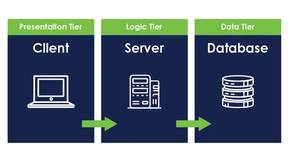

# Tabletop Game Community Application

###### Technical Report

---

# Client/Server Analysis

---

## Architecture

The idea for this application is for it to follow a 3-tier architecture, initially built for web browsers, with the
ultimate goal of developing a hybrid app primarily for smartphones.
We are selecting 3-tier architecture, meaning that the data, application, and presentation will be held in separate 
layers, being the most adequate and widely used architecture for an app of this type.



### Benefits of 3-tier application architecture

- **Maintenance**  
  Having each layer of the application separated will prove to be more efficient when updates and modifications need to 
  be applied, as each layer will be isolated from the others, allowing one to be manipulated without impacting the others.

- **Scalability**  
  Each layer can be scaled independently so that when the app begins to have more traffic, more servers can be added 
  easily to reflect necessity.

- **Flexibility**  
  Different technologies can be used in each layer of the application, allowing the most adequate tools and languages to
  be selected for its development.

- **Security**  
  The same separation that leads to improvements in maintainability, scalability, and flexibility renders itself useful 
  for security, as each layer will be able to have its own distinct protection measures, thereby improving overall security.

Image credits to - [https://www.zirous.com/2022/11/15/three-tier-architecture-approach-for-custom-applications-2/](https://www.zirous.com/2022/11/15/three-tier-architecture-approach-for-custom-applications-2/)

---

## Front-end Workings

Front-end development, often synonymous with the presentation layer, focuses on creating the visual elements and user
interface of web applications that users interact with directly. It involves using technologies like HTML, CSS, and
JavaScript to build responsive and dynamic layouts, ensuring an engaging user experience across different devices and browsers.


Image credits to - [https://torquemag.io/2020/06/browser-developer-tools-tutorial/](https://torquemag.io/2020/06/browser-developer-tools-tutorial/)

---

## Browsers

Browsers are essential tools that allow users to access web applications by interpreting HTML, CSS, and JavaScript. They
serve as intermediaries between users and web content, using different rendering engines—such as Blink in Chrome and 
Opera, Gecko in Firefox, and Trident in Internet Explorer—to process and display pages.

   

Image credits to - [https://www.pcmag.com/picks/chrome-edge-firefox-opera-or-safari-which-browser-is-best](https://www.pcmag.com/picks/chrome-edge-firefox-opera-or-safari-which-browser-is-best)

---

### Browser Lifecycle

The client's device makes a request to the application server to access the application. The app server returns the data
required and what needs to be shown (rendered) on the device's screen. In the case of a browser-based web application, 
the browser receives this data from its networking layer, which is then passed on to the rendering engine.

### Rendering Pipeline

   


1. **HTML parsing into DOM**  

  - The rendering engine parses the HTML data and converts it into a Document Object Model (DOM) nodes into a tree called
  the "DOM tree" or "Content tree." Each node corresponds to an HTML tag, forming the content structure of the page.

2. **CSS parsing into CSSOM**  

  - Simultaneously, the browser parses the CSS stylesheets and inline styles to build a CSS Object Model (CSSOM), which 
  is a tree-like structure representing the styles to be applied to the DOM.

3. **JavaScript Execution**  

  - Once the DOM and CSSOM are built, the browser executes JavaScript. JavaScript can modify both the HTML (DOM) and CSS 
  (CSSOM). However, JavaScript execution can block other processes, particularly parsing, unless asynchronous or deferred
  methods are used to load the scripts.

4. **Layout Phase**  

  - The browser uses the DOM and CSSOM to create a Render Tree, which defines the layout of the page. This step calculates
  the positions of all elements on the page. Any changes to the DOM or CSSOM trigger reflow, which recalculates the 
  layout—a potentially resource-intensive task.

5. **Painting** 

  - After the layout is determined, the browser begins the paint process, converting elements into pixels. The browser 
  uses its graphics engine (e.g., Skia in Chromium-based browsers or WebRender in Firefox) to render these pixels on the
  screen. The final painted image is then displayed to the user.

Image credits to [https://webperf.tips/tip/browser-rendering-pipeline/](https://webperf.tips/tip/browser-rendering-pipeline/)

---

## Frameworks and Libraries


The browser’s default rendering process can effectively display web pages, but it becomes inefficient for dynamic content
or frequent updates because it often involves transferring large amounts of data or re-rendering entire pages. To improve
performance and user experience, front-end libraries and frameworks like React, Vue.js, and Angular have emerged, giving
way to single-page applications (SPAs).


These frameworks optimize the rendering process by creating a Virtual DOM, a lightweight in-memory representation of the
actual DOM. Only the necessary changes between the virtual DOM and the actual DOM are sent to the browser, reducing
re-rendering and improving performance.

> Libraries are collections of pre-written code that developers use to perform specific tasks, offering flexibility and 
> reusability. Frameworks, on the other hand, provide a structured foundation for building applications, enforcing 
> certain conventions and workflows. While libraries allow for more freedom, frameworks guide development with predefined
> patterns. Both are essential tools in modern software development. React is a library and not a framework, but for 
> simplicity's sake, will be, at times, referred to as a framework.

### Front-end Framework Lifecycle  
These front-end frameworks also introduce a component-based architecture. The lifecycle of these components is essential
to understanding how they render, update, and clean up during their existence.

1. **Mounting**  
  The component is created and inserted into the DOM. This is when the constructor is called in React, initializing the
  component’s state and props. The state represents data that belongs to the component and triggers updates whenever it changes.

2. **Updating**  
  Changes in the component’s state or props trigger an update and re-render. In React, updates can be triggered by 
  events like form input changes, mouse clicks, or keyboard interactions, which alter the state and cause the component 
  to re-render with the updated information. These updates are efficient, only re-rendering parts of the UI affected by 
  the change.

3. **Unmounting**  
  When a component is no longer needed, it is removed from the DOM, and React cleans up any associated resources, like 
  event listeners or timers, to prevent memory leaks.

Image credits to - [https://sourcebae.com/blog/what-is-the-best-front-end-framework-to-learn-and-why/](https://sourcebae.com/blog/what-is-the-best-front-end-framework-to-learn-and-why/)

---

## Back-end Workings

The back-end refers to the server-side of web applications, responsible for managing data, application logic, and user 
authentication. It typically involves technologies such as databases (e.g., MySQL, MongoDB), server-side programming 
languages (e.g., Node.js, Python, Ruby), and frameworks (e.g., Express, Django). The back-end handles requests from the 
front-end, processes them, and sends the appropriate responses, ensuring seamless interaction between the user interface
and the underlying data systems.


   

Image credit to - [https://medium.com/@adityagaba1322/streamlining-backend-frontend-integration-a-quick-guide-145eca3cca05](https://medium.com/@adityagaba1322/streamlining-backend-frontend-integration-a-quick-guide-145eca3cca05)

---

### Business Layer

   

The business layer, often referred to as the business logic layer, is a crucial component of a 3-tier architecture in 
software development. Its primary role is to encapsulate the core business rules and processes that dictate how data is 
created, stored, and manipulated within the application. It serves as a middle ground between the database and the front
end, ensuring that data is properly accessed, manipulated, and stored.


> While the rest of the business section will speak primarily from the perspective of the Spring framework, most of the 
> responsibilities and methods will be applicable to various frameworks.

**Responsibilities**

- **Business Logic Implementation**  
  It defines the rules and conditions under which data can be processed, ensuring that operations align with business 
  requirements. In the case of Spring, service methods are provided to handle tasks such as creating, deleting, updating,
  and reading data from the database or (CRUD) operations. To help keep the front-end data models separate from the database
  models, aside from the fact that many times they are not a 1:1 replica of each other, Data Transfer Objects are used to 
  transfer data between the business logic and user interface.

- **Data Validation**  
  The business layer validates incoming data to ensure it meets specified criteria before processing it. Annotations 
  incorporated into the framework such as `@Valid` and `@Validated` are used to enforce validation rules on data being 
  processed and help ensure data integrity.

- **Transaction Management**  
  It manages transactions to ensure data integrity, allowing operations to be rolled back if an error occurs. For example,
  Spring's annotation `@Transactional` allows certain parameters and behaviors to be set to control the way data is being 
  handled between the business logic and database.

- **Communication with Data Layer**  
  The business layer interacts with the data layer to retrieve and manipulate data, providing a clear separation between
  business logic and data access. Integration with external services allows the business layer to enhance functionality 
  or retrieve additional data. The `@Repository` annotation offers a selection of data access methods, adding a layer of
  abstraction between the business layer and the database.

> By isolating business logic from the presentation and data layers, the business layer promotes modularity, making it 
> easier to maintain and update the application as business needs evolve.

Image credit to - [https://codingnomads.com/what-is-spring-for-java-overview](https://codingnomads.com/what-is-spring-for-java-overview)

---

### Data Layer

   

The data layer is a foundational component of a 3-tier architecture in software development. Its primary role is to manage
the storage, retrieval, and manipulation of data within the application. This layer interacts directly with the database
and serves as the interface for the business layer, ensuring that data is efficiently managed and securely accessed.

> While this section will primarily reference Java Persistence API (JPA) for the data layer, the principles discussed are
> applicable across various frameworks.

### Responsibilities 

- **Data Storage and Retrieval**  
  The data layer handles all interactions with the database, including storing, retrieving, and deleting data. JPA 
  facilitates this by providing an abstraction over the database, allowing developers to work with Java objects instead 
   of raw SQL queries. Using JPA repositories, you can easily perform CRUD (Create, Read, Update, Delete) operations 
  with minimal **boilerplate** code.

> Boilerplate code refers to sections of code that are repeated in multiple places with little or no variation. It 
> typically includes standard or routine tasks that developers must perform to set up functionality, but which do not 
> contribute to the unique features of the application. This kind of code can be tedious to write and maintain.

- **Data Abstraction**  
  JPA abstracts the complexities of database interactions from the business layer. By defining entity classes that map 
  to database tables, developers can interact with data using object-oriented paradigms. Annotations like `@Entity`, 
  `@Table`, and `@Id` in JPA are used to define these mappings, simplifying data access and manipulation.

- **Data Integrity**  
  The data layer ensures the integrity and consistency of the data stored in the database. JPA allows the use of 
  validation annotations (e.g., `@NotNull`, `@Size`) directly on entity attributes, ensuring that data adheres to 
  specified constraints before being persisted. Furthermore, JPA handles optimistic locking and transactions, ensuring 
  that data remains consistent even in concurrent environments.

- **Integration with External Data Sources**  
  The data layer can also interact with external data sources or services, allowing for data retrieval or manipulation 
  beyond the primary database. This can be accomplished using APIs or third-party libraries, enabling the application to
  leverage additional data or services.

- **Performance Optimization**  
  Efficient data access is critical for application performance. JPA provides features like caching, lazy loading, and 
  batch processing to optimize database interactions, reducing latency and improving overall responsiveness.

 By encapsulating data management within the data layer, applications can achieve better separation of concerns, making
 it easier to maintain and extend functionality while ensuring data integrity and performance.

 

Image credit to - [https://www.toptal.com/database/database-design-bad-practices](https://www.toptal.com/database/database-design-bad-practices)

---

# Web Development Languages

Web development relies on various programming languages, each suited for specific tasks, from client-side scripting to 
server-side logic and database management. Below is a list of the most widely used languages in modern web development, 
categorized based on their primary use cases.

   

Image credit to - [https://robodk.com/blog/robot-sdk/programming-language-png-download-image/](https://robodk.com/blog/robot-sdk/programming-language-png-download-image/)

---

## Script Language Characteristics

On the client side, web development often relies on scripting languages such as **JavaScript**, **Ruby**, **Python**, and **Perl** (depending on the specific needs of the application). Scripting languages are commonly preferred for front-end web development due to their characteristics, which offer advantages in flexibility and rapid development, especially when compared to traditional compiled programming languages.

### Scripting Languages vs. Traditional Programming Languages

One key difference between scripting languages and traditional programming languages is how they are executed. Scripting languages are typically interpreted, meaning the code is executed directly without the need for prior compilation. This leads to faster development cycles, as developers can quickly make and test changes without compiling the entire codebase. In contrast, traditional programming languages are often compiled into machine code, which results in faster execution but requires an additional compilation step before running the code.

### Scripting Languages

Scripting languages offer several advantages for front-end web development, making them suitable for tasks that require flexibility, dynamic behavior, and ease of maintenance. Key characteristics include:

- **Dynamic Typing**: Variables do not require explicit type declarations, allowing for more flexible and adaptable code.
- **Interpreted Execution**: Code can be run directly without the need for compilation, enabling rapid development and easier testing.
- **Efficiency in Repetitive Tasks**: Scripting languages are ideal for automating repetitive actions within the application, such as handling user interactions.
- **One-off Task Performance**: They are well-suited for performing specific, short-lived tasks without the overhead of more rigid languages.
- **Dynamic Web Page Creation**: Scripting languages excel in creating interactive and dynamic web pages, enhancing user experience through real-time updates and responsiveness.

### Traditional Programming Languages

Traditional programming languages, such as **Java**, **C++**, and **C#**, are compiled languages typically associated with developing large, complex applications. While they offer advantages in performance and reliability, they require more stringent development practices and are less flexible for rapid front-end changes. Key characteristics include:

- **Strict Typing**: Variables must be explicitly declared with their data types, reducing runtime errors and resulting in more reliable, predictable code.
- **Compiled Code**: The code is compiled into machine code, resulting in faster execution times, especially for performance-critical tasks.
- **Scalability for Complex Applications**: These languages are designed for building large, complex systems such as enterprise applications, operating systems, and hardware drivers.
- **System-Level Programming**: Traditional languages are optimal for tasks that require close interaction with hardware or the operating system, such as creating system applications and drivers.
- **Optimal for Database Programming**: Compiled languages are commonly used for database-heavy applications due to their speed and reliability.

> By understanding the differences between scripting and traditional programming languages, developers can choose the most appropriate toolset for the specific needs of their web applications. Scripting languages offer the flexibility and rapid iteration needed for front-end development, while traditional languages provide the performance and scalability required for large-scale systems.

---
## Client-side Languages

Client-side languages are executed in the user's web browser, providing interactivity, dynamic content, and responsive user interfaces.


### JavaScript

  JavaScript is the most widely used client-side scripting language and is essential for creating dynamic and interactive
  web applications. It also supports server-side development via Node.js.
  - **Advantages**:
    - Vast ecosystem and widespread browser support.
    - Enables real-time updates and dynamic content rendering.
    - Versatile, can be used both client-side and server-side (with Node.js).
  - **Disadvantages**:
    - Vulnerable to security issues such as cross-site scripting (XSS).
    - Can be subject to browser compatibility issues, requiring careful testing.

### TypeScript

  TypeScript is a statically typed superset of JavaScript that improves code maintainability and productivity, especially
  in large-scale applications. It compiles to JavaScript and adds features like type annotations.
  - **Advantages**:
    - Provides type safety and helps catch errors during development.
    - Great for maintaining large codebases with improved tooling.
    - Integrates seamlessly with modern JavaScript frameworks (e.g., React, Angular).
  - **Disadvantages**:
    - Requires a compilation step to convert TypeScript into JavaScript.
    - Steeper learning curve for developers unfamiliar with statically typed languages.

Image credits to - [https://codecondo.com/12-top-skills-needed-to-be-a-front-end-developer/](https://codecondo.com/12-top-skills-needed-to-be-a-front-end-developer/)

---

## Server-side Languages

Server-side languages run on the web server and are responsible for processing requests, handling business logic, and managing databases.

   

### Python  
  Python is a versatile, high-level programming language often used for web development with frameworks like Django and Flask. It is known for its simplicity and readability.
  - **Advantages**:
    - Easy to learn and has a clean, readable syntax.
    - Extensive libraries and frameworks for rapid development.
    - Suitable for both small and large-scale web applications.
  - **Disadvantages**:
    - Slower execution speed compared to statically typed, compiled languages.
    - Not the best choice for high-concurrency or performance-critical applications.

### Java  
  Java is a robust, object-oriented language commonly used in enterprise-level applications. It is platform-independent, making it a go-to for building scalable web systems.
  - **Advantages**:
    - Highly stable and reliable for large, complex applications.
    - Strong concurrency support, making it ideal for high-traffic environments.
    - Mature frameworks (e.g., Spring Boot) support efficient web development.
  - **Disadvantages**:
    - More verbose compared to modern languages like Python or JavaScript.
    - Slower development process, especially for smaller projects.

### C#  
  C# is a modern, object-oriented programming language developed by Microsoft, often used for back-end development in ASP.NET Core applications.
  - **Advantages**:
    - Excellent integration with the Microsoft ecosystem, including Azure and Visual Studio.
    - Well-suited for developing secure, scalable enterprise applications.
    - Good performance with support for asynchronous programming.
  - **Disadvantages**:
    - Primarily tied to the Microsoft stack, though .NET Core offers cross-platform capabilities.
    - Less popular outside of Windows development, limiting developer resources.

### PHP  
  PHP is a widely-used server-side scripting language, especially for web development. It powers many content management systems (CMS) like WordPress and Drupal.
  - **Advantages**:
    - Optimized for web development with built-in support for database interaction.
    - Easy to learn and use, making it accessible for new developers.
    - Large community support and a wide range of frameworks (e.g., Laravel, Symfony).
  - **Disadvantages**:
    - Inconsistent design can lead to messy or hard-to-maintain code.
    - Performance is inferior to newer server-side languages like Go or Node.js.

### Ruby  
  Ruby is a dynamic, object-oriented programming language known for its simplicity and elegance. It is primarily used with the Ruby on Rails framework to build web applications.
  - **Advantages**:
    - Emphasizes developer productivity and clean, readable code.
    - Rails framework simplifies web development with built-in conventions.
    - Strong community and a large number of reusable gems (libraries).
  - **Disadvantages**:
    - Slower performance compared to languages like Java or Go.
    - Limited scalability for very large or concurrent applications.

### Go (Golang)  
  Go is a statically typed, compiled language developed by Google, known for its simplicity, performance, and built-in concurrency features.
  - **Advantages**:
    - Excellent performance due to its compiled nature and efficient garbage collection.
    - Built-in support for concurrency and parallelism, making it ideal for scalable applications.
    - Simple syntax, making it easy to learn and use.
  - **Disadvantages**:
    - Limited ecosystem compared to more established languages like Java or Python.
    - Still relatively new, so there are fewer resources and libraries available.

Image credits to - [https://pixelstreet.in/blog/front-end-vs-back-end-development/](https://pixelstreet.in/blog/front-end-vs-back-end-development/)

---

## Database and Query Languages

These languages are used to interact with databases, enabling developers to store, retrieve, and manage application data.

   

### SQL (Structured Query Language)  
  SQL is the standard language for querying and managing relational databases like MySQL, PostgreSQL, and SQLite.
  - **Advantages**:
    - Standardized language for interacting with relational databases.
    - Efficient for performing CRUD (Create, Read, Update, Delete) operations.
    - Well-supported across numerous relational database management systems.
  - **Disadvantages**:
    - Less flexible for non-relational or hierarchical data structures.
    - May suffer from performance bottlenecks with very large datasets or poorly optimized queries.

Image credit to - [https://www.linkedin.com/pulse/sql-darshika-srivastava-1f](https://www.linkedin.com/pulse/sql-darshika-srivastava-1f)

---

## Other Languages

These languages are used for specialized purposes in web development or performance-critical areas.

### Perl  
  Perl is a mature scripting language known for its powerful text-processing capabilities, often used in server 
  administration and web scripting tasks.
  - **Advantages**:
    - Excellent for handling regular expressions and text processing.
    - Mature language with a wide range of modules and libraries.
  - **Disadvantages**:
    - Declining popularity in modern web development.
    - Perl code can become hard to maintain, leading to the term “write-only code.”

### C++  
  C++ is a powerful, statically typed, compiled language often used for system-level programming. It is not commonly 
  used for web development, but can be leveraged for performance-critical components.
  - **Advantages**:
    - High performance and control over system resources.
    - Useful for building performance-critical components of web applications.
  - **Disadvantages**:
    - Steep learning curve and complex syntax.
    - Requires manual memory management, leading to potential risks of errors or memory leaks.

These languages collectively form the foundation of modern web development, each offering specific strengths and 
weaknesses depending on the project requirements.

---

# Browser Compatibility

---

### Are All Browsers Compatible with the Same Web Application?

All major browsers strive to comply with standards set by the W3C (World Wide Web Consortium) and the WHATWG (Web Hypertext
Application Technology Working Group). This commitment helps ensure a high level of compatibility and support for the 
latest features of HTML, CSS, and JavaScript. However, differences between browsers can still lead to compatibility issues,
affecting the functionality and appearance of web applications across different environments.


### Possible Compatibility Issues

- **JavaScript APIs**: Browsers may vary in their support for certain APIs. If an application depends on these APIs for 
  functionality, special care must be taken to ensure compatibility. For instance, features like `fetch()` may not be 
  supported in older browsers, necessitating polyfills.

> Polyfills are scripts or libraries that offer new browser functionalities to older browsers that might not 
> support them

- **Experimental CSS**: Some experimental CSS properties may require different prefixes (like `-webkit-`, `-moz-`, etc.) 
  for different browsers. This means developers often need to write additional CSS rules to accommodate various browser engines.

- **Web Components**: Support for web components can also vary among browsers, particularly in older versions. Developers 
  should ensure that the custom elements, shadow DOM, and HTML templates they use are supported.

- **Responsive Design**: Differences in how browsers render CSS can affect responsive designs. Layouts might look 
  different across browsers due to varying interpretations of the CSS specifications.

### Ways to Avoid Compatibility Issues

While compatibility issues are nearly inevitable, proper testing to assess compatibility and tracking known issues is of
utmost priority. Additionally, several practices can help ensure browser compatibility.

### Solutions

- **Use Standardized Web Technologies**: Adhere to standardized web technologies recommended by the W3C. Using 
  well-established practices minimizes the risk of compatibility issues.

- **Follow Clean Coding Practices**: Write clear, maintainable code and adhere to best coding standards, which can 
  improve the overall quality and compatibility of the application.

- **Conduct Cross-Browser Testing**: Utilize tools like BrowserStack or Sauce Labs to test your application on multiple 
  browsers and devices. Automated testing frameworks like Selenium can also help in ensuring that your application 
  behaves as expected across different environments.

- **Utilize Feature Detection Libraries**: Use feature detection libraries such as Modernizr to verify feature support 
  before applying functionalities. This approach allows you to provide fallbacks for browsers that do not support 
  specific features.

- **Stay Updated**: Keep abreast of the latest browser updates and changes in standards. Regularly review compatibility 
  tables such as those provided by MDN Web Docs to understand the current support landscape.

- **Progressive Enhancement**: Implement a progressive enhancement strategy, ensuring that your application is functional
  for users with basic browsers while offering enhanced features for those with modern capabilities.

> By incorporating these practices, developers can significantly reduce compatibility issues and create web applications 
that function consistently across various browsers and platforms.

Image credit to - [Da Vinci SDK](http://davincisdk.blogspot.com/2013/11/html5-browser-support.html)

---

# Markup Languages Integration

HTML is the standard markup language for web development, used to structure content across virtually all websites. 
Alongside it, CSS is the predominant language for styling, and JavaScript dominates the web as the primary scripting 
language. Together, these three technologies form the backbone of web development, enabling the creation of dynamic, 
interactive, and responsive web applications.

---

## JavaScript can manipulate HTML and CSS


### Native JavaScript  

JavaScript is a high-level, dynamic programming language widely used for web development. It enables interactive and 
responsive features in web applications by allowing developers to manipulate the Document Object Model (DOM), handle 
events, and make asynchronous requests. As a core technology of the web, JavaScript is essential for creating rich user 
experiences alongside HTML and CSS.


- JavaScript can directly manipulate HTML and CSS by interacting with the DOM (Document Object Model). Developers use
methods like document.getElementById(), document.querySelector(), and document.querySelectorAll() to select specific
elements and change their properties.

```javascript
const element1 = document.getElementById('myElement');  
const element2 = document.querySelector('.myClass');
const elements = document.querySelectorAll('.myClass');
```

- Once the element is selected, JavaScript can modify its properties, such as changing the text content, or styling.

```javascript
// Accessing an element's methods
element.innerHTML = "New content!"; // changes the content of the element
element.classList.add("newClass"); // adds a new CSS class to the element
element.style.backgroundColor = "red"; // changes the background color of the element
```

- Developers can also add event listeners to respond to user interactions like clicks or key presses.

```javascript
let button = document.getElementById("myButton");
button.addEventListener("click", function() {
     console.log("Button clicked!");
});
```
> These techniques enable developers to build interactive and dynamic web pages.

Image credit to - [https://simple.wikipedia.org/wiki/JavaScript](https://simple.wikipedia.org/wiki/JavaScript)

---

### React JavaScript

React is an open-source JavaScript library developed by Facebook for building user interfaces, particularly single-page 
applications. It enables developers to create reusable UI components that efficiently update and render in response to 
data changes, enhancing performance and user experience. With a component-based architecture and a virtual DOM, React 
simplifies the development of dynamic web applications.


Image credits to - [https://medium.com/@kalanamalshan98/unleashing-the-power-of-react-js-real-world-benefits-and-examples-db9165aa1376](https://medium.com/@kalanamalshan98/unleashing-the-power-of-react-js-real-world-benefits-and-examples-db9165aa1376)

**Declarative Syntax**
: Unlike native JavaScript, React uses a declarative syntax that allows developers to describe 
what the UI should look like based on the current state of the application. Instead of directly manipulating the DOM, 
developers create components that represent parts of the UI, and React automatically updates the DOM when the state 
changes.

```javascript
import React, { useState } from 'react';

const MyComponent = () => {
const [content, setContent] = useState("Initial content");

    return (
        <div>
            <p>{content}</p>
            <button onClick={() => setContent("New content!")}>Change Content</button>
        </div>
    );
};
```

> In this example, the state is managed using the useState hook, and when the button is clicked, the state updates, 
which triggers a re-render of the component. React handles the necessary DOM and virtual DOM manipulation behind the 
scenes, leading to cleaner and more maintainable code.

---


## HTML can import JavaScript and CSS

HTML has the ability to import external JavaScript and CSS files using the `<script>` and `<link>` tags, respectively.


### JavaScript Import  
JavaScript files can be executed in HTML by either -  
- Placing the script in between opening and closing `<script>` tags.

```html
<script>
  console.log('Hello World!');
  // JavaScript code here
</script>
```

- Or linking an eternal JavaScript file using the `src` attribute. Which will give that HTML file access to the JS code 
without having to write all the code in the same file as the HTML.

```html
<script src="script.js">
  //Some super cool JavaScript
</script>
```

Image credit to - [https://www.oxfordwebstudio.com/en/did-you-know/what-is-html](https://www.oxfordwebstudio.com/en/did-you-know/what-is-html)

---

## CSS applies styles to HTML


Cascading style sheets can also be applied to HTML in a similar way to JavaScript. CSS can be applied to HTML by either -

- Placing the CSS code in between opening and closing `<style>` tags

```html
<style>
  body {
    background-color: lightblue;
  }
</style>
```

- Or linking an eternal CSS file using the `href` attribute. Which will give that HTML file access to the CSS code.
The `rel` attribute specifies the relationship between the HTML file and the linked file.

```html
<link rel="stylesheet" type="text/css" href="styles.css">
```

Image credits to - [https://delta-dev-software.fr/beginners-guide-to-learning-css-cascading-style-sheets-tutorial](https://delta-dev-software.fr/beginners-guide-to-learning-css-cascading-style-sheets-tutorial)

---

# Web Client Programming Tools

When developing a modern web application, a combination of front-end, back-end, and styling tools is essential to create
an efficient, scalable, and user-friendly application. These tools are often divided into **libraries** and **frameworks**,
depending on the functionality and structure they provide.

---

## Front-end Tools

The **front-end** focuses on the presentation layer of the application—what the user interacts with directly. This 
involves HTML, CSS, and JavaScript for building dynamic and responsive user interfaces.

### Libraries and Frameworks
Libraries are collections of reusable code snippets, functions, or classes that help perform common tasks more efficiently
without enforcing a specific project structure.

- **React**: A popular JavaScript library for building interactive user interfaces with a component-based architecture. 
  It is widely used for creating dynamic single-page applications (SPAs).
- **Vue.js**: A progressive JavaScript framework focused on building user interfaces, particularly SPAs. Vue is lightweight,
  flexible, and integrates easily with other libraries.
- **Svelte**: A relatively new JavaScript compiler that shifts much of the work to compile-time, resulting in highly 
  optimized and fast web applications.
- **Preact**: A lightweight alternative to React with similar functionality but a smaller bundle size, making it ideal 
  for performance-conscious projects.
- **Alpine.js**: A minimal front-end framework that provides simple JavaScript behavior for HTML elements. It’s often 
  used for enhancing static websites or handling small interactive elements.

---

## Back-end Tools

The **back-end** is responsible for server-side processing, including handling requests, business logic, database 
interactions, and ensuring smooth communication between the client and the server.

### Frameworks
Frameworks are more structured environments that provide the skeleton for web applications. They typically handle more 
complex workflows by enforcing best practices and common design patterns.

- **Express**: A minimalist back-end framework for Node.js, widely used for building APIs and web applications. Its 
  simplicity and flexibility make it a popular choice for developing RESTful APIs.
- **Spring**: A robust Java-based framework designed to build enterprise-level web applications and APIs. Spring Boot 
  simplifies the development of back-end services and provides built-in tools for security and database management.
- **Django**: A high-level Python web framework that emphasizes the rapid development of secure and scalable applications.
  Django includes features such as an ORM, admin interface, and authentication right out of the box.
- **Flask**: Another Python web framework, but more lightweight than Django. Flask offers flexibility in how developers
  can structure their applications, making it ideal for smaller projects or microservices.
- **Laravel**: A PHP framework that offers a clean and elegant syntax for developing modern web applications. It includes
  features like routing, middleware, and an ORM called Eloquent.
- **Symfony**: Another PHP framework, Symfony is known for its flexibility and large library of reusable components. 
  It is often used in large enterprise applications.
- **ASP.NET Core**: A cross-platform framework for building web applications and APIs using C#. It’s widely used in 
  enterprise environments, offering performance optimization and scalability.

### Full-stack Frameworks

These frameworks cover both the **front-end** and **back-end**, providing a cohesive environment for end-to-end development.

- **Angular**: A powerful front-end framework from Google that includes a fully integrated solution for building 
  large-scale, high-performance SPAs. It uses TypeScript and supports two-way data binding.
- **Next.js**: A React framework that provides server-side rendering and static site generation, making it ideal for 
  building SEO-friendly web applications.
- **Vue.js (Nuxt.js)**: An enhanced version of Vue.js designed for server-side rendering and static site generation, 
  useful for building high-performance applications.

### CMS Frameworks

For content-heavy websites, **content management systems (CMS)** like Drupal offer a foundation for creating dynamic 
content-driven applications.

- **Drupal**: An open-source CMS framework written in PHP, designed for managing content-rich websites. It includes 
built-in user management, content workflows, and extensive plugin support.

These tools provide developers with a range of solutions for handling the complexity of modern web development, enabling
efficient and scalable application development across multiple platforms.

### Runtime Environments
  - Node.js:

---

### Integrated Development Environments (IDEs)


IDEs are crucial tools for modern web development, providing developers with comprehensive environments that facilitate 
coding, testing, and debugging. They integrate various tools into a single application, streamlining the development process.

#### Popular IDEs for Web Development

 - Visual Studio Code: A lightweight, open-source code editor developed by Microsoft. It offers extensive support for 
JavaScript, HTML, CSS, and many frameworks through a rich ecosystem of extensions. Its integrated terminal, debugging 
capabilities, and Git support make it a popular choice among web developers.
    
 - WebStorm: A powerful IDE specifically designed for JavaScript development. Developed by JetBrains, WebStorm provides 
advanced coding assistance, navigation, and refactoring tools, making it ideal for large projects using React, Vue, or 
Angular.
   
 - Eclipse: An open-source IDE widely used for Java development, but it also supports web technologies through various 
plugins. It is particularly favored for Spring development, providing integration with JPA and other Java frameworks.
   
 - IntelliJ IDEA: Another JetBrains product, this IDE offers robust support for Java and Spring development, making it 
suitable for full-stack applications. It includes intelligent code assistance and various tools for testing and deployment.
   
 - Atom: An open-source text editor developed by GitHub, known for its hackability and customization. While not a full 
IDE, it supports numerous plugins for enhancing web development workflows.
   
 - Sublime Text: A lightweight and fast code editor that supports various languages. It is extensible through plugins, 
making it suitable for quick edits and projects.

These IDEs enhance productivity by offering features such as syntax highlighting, code completion, debugging tools, and 
version control integration, enabling developers to focus on building high-quality web applications.

Image credits to - [https://kasun-r-weerasinghe.medium.com/ides-and-code-editors-d2800d10dda5](https://kasun-r-weerasinghe.medium.com/ides-and-code-editors-d2800d10dda5)

---

## Market Analysis

### Overview of the Warhammer 40k Market

The Warhammer 40k community is a dedicated and niche market that continues to grow, driven by the enthusiasm of its 
players, hobbyists, and the wider fan base. With the recent release of the 10th edition of Warhammer 40k and the public 
support from celebrities such as Henry Cavill, Trey Parker, and Ed Sheeran, the game's visibility has surged. The 
Warhammer brand has managed to expand into various forms of media, including books, video games, and tabletop games, 
creating a rich ecosystem for players and hobbyists to immerse themselves in. This ecosystem, however, comes with 
challenges, particularly the high cost of entry into the hobby, and difficulties in navigating the secondary market for 
used models and hobby supplies.

Adeptus Nexus aims to tap into this growing market by offering an application that consolidates various aspects of the 
Warhammer 40k experience. The app's primary focus will be on providing a marketplace for players to sell and trade 
miniatures, hobby supplies, and offer services such as custom painting or terrain building, while also creating a 
centralized community hub for discussions, strategy sharing, and news.

---

### Existing Competition

Currently, Warhammer 40k players rely on a variety of platforms for different aspects of the hobby:

- Facebook Marketplace: While popular for buying and selling goods, Facebook is a general platform that lacks focus on 
the specific needs of Warhammer players, such as detailed model listings or a niche audience dedicated solely to the hobby.
It's also crowded with non-relevant content.

- Wallapop: This platform provides localized listings but is not specific to Warhammer, and it often lacks the detailed
information players need when buying or trading miniatures or paints.
 
- eBay: A popular marketplace where users buy and sell Warhammer models. However, eBay's marketplace can suffer from 
inflated prices due to auction dynamics, and it doesn't offer community features like discussions, strategy sharing, or
services (e.g., miniature painting) that are vital to the hobby.

- WhatsApp Groups: Many local groups have sprung up for buying, selling, and discussing Warhammer-related content. While
functional for communication, these groups are typically unstructured, lack organization, and don’t scale well for large
communities or national reach.

- Discord Servers: Several communities have created Discord servers for Warhammer discussions, but these are typically 
scattered, lack unified functionality, and are not optimized for buying or trading items.

---

### Adeptus Nexus: Differentiation and New Value

#### Adeptus Nexus seeks to differentiate itself from the competition in several key ways:

- Dedicated Marketplace: Unlike Facebook Marketplace or eBay, which cater to a broad audience, Adeptus Nexus will be a 
platform exclusively for Warhammer players. This focus allows for highly specific listings, including details like 
miniature conditions, edition compatibility, and painting quality, tailored to the needs of the Warhammer community. 
This centralized market for Warhammer 40k items and services reduces the friction of navigating through general platforms.

- Community-Centric Features: The app goes beyond mere transactions by fostering a community-driven space where players 
can discuss tactics, share lore, and connect with other players. Features such as The Citadel forum and The Librarius 
lore section will provide spaces for players to engage with the content they care about. In contrast, platforms like 
eBay and Wallapop are purely transactional with no community-building capabilities.

- Service-Oriented Features: Adeptus Nexus will offer a space for hobbyists to not only buy and sell miniatures but also
trade services like custom miniature painting or terrain building (The Forge). This sets it apart from eBay or Facebook,
which are not optimized for facilitating freelance services within the hobby.

- Up-to-Date Warhammer Content: Adeptus Nexus will also include features like The Strategium, where users can stay 
updated with the latest rules, tournaments, and tactics. None of the currently available platforms provide this real-time
connection to Warhammer’s evolving gameplay, offering players a one-stop location to stay informed and connected.

- Organized Events and Tournaments: Adeptus Nexus will allow users to post and search for local and global Warhammer 
tournaments and events, streamlining the process for players to find competitions or gatherings. This contrasts with 
WhatsApp or Discord groups, which lack a structured and scalable way of managing such event listings.

#### Unique Value Proposition

In contrast to the fragmented and often poorly targeted platforms that exist today, Adeptus Nexus provides a consolidated space for Warhammer enthusiasts, unifying the marketplace, community features, hobby services, and event listings into a single platform. The app addresses the Warhammer community’s specific needs more effectively than general platforms like eBay, Facebook Marketplace, and Wallapop, while also offering the additional functionality of community engagement and service provision that those platforms cannot match. This one-stop-shop approach to all things Warhammer is the core value that sets Adeptus Nexus apart.
Conclusion

While there are multiple platforms available for Warhammer players to engage with various parts of the hobby, none offer a holistic, dedicated experience like Adeptus Nexus. By providing a centralized community space, an exclusive marketplace, and hobby-related services, Adeptus Nexus fills a gap in the market. This new value—of convenience, specificity, and community engagement—will help the app stand out from the competition and create a strong, loyal user base within the Warhammer 40k community.

---

## Bibliography 

[Browser rendering pipeline](https://webperf.tips/tip/browser-rendering-pipeline/)  
[Browser working mechanisms](https://medium.com/tech-desk/browsers-and-their-working-mechanisms-33a6a6e3a681)  
[How a web application works](https://medium.com/@mikesparr/how-web-applications-work-3824f4b7ebeb)  
[What is business logic](https://www.g2.com/articles/business-logic)  
[Understanding business logic](https://www.integrify.com/what-is-business-logic/)
[Scripting Languages vs Traditional Languages](https://www.unosquare.com/blog/scripting-and-programming-languages-differences-advantages-and-optimal-use-cases/)
[Top Web Programming Languages](https://flatirons.com/blog/top-10-web-programming-languages-for-2023/)  
[Best Web Development Languages](https://inveritasoft.com/blog/the-best-web-application-development-languages)  
[Most Used Programming Languages](https://www.tiobe.com/tiobe-index/)
[Manipulating HTML with JavaScript](https://www.geeksforgeeks.org/manipulating-html-elements-with-javascript/)
[Intro to React](https://react.dev/learn)  
[What is React](https://medium.com/@xspaces2011/introduction-to-react-f197c4eb67f4)  
[How HTML, CSS and JavaScript work together](https://www.webosaurus.co.uk/news/web-design-basics-how-html-css-and-javascript-work-together/)  
[HTML and JavaScript Integration](https://daily.dev/blog/html-and-javascript-integration-basics)
[Importing CSS into HTML](https://www.w3schools.com/html/html_css.asp)  
[How to link CSS to HTML](https://www.freecodecamp.org/news/how-to-link-css-to-html/)
[Technology market share](https://6sense.com/tech/languages/javascript-market-share)
[Essential Libraries](https://medium.com/@kirushikanketheeswaran/web-development-with-essential-libraries-15d730fb735f)
[Top 10 Web development Frameworks and Libraries](https://emerline.com/blog/top-10-best-web-development-frameworks-and-libraries)